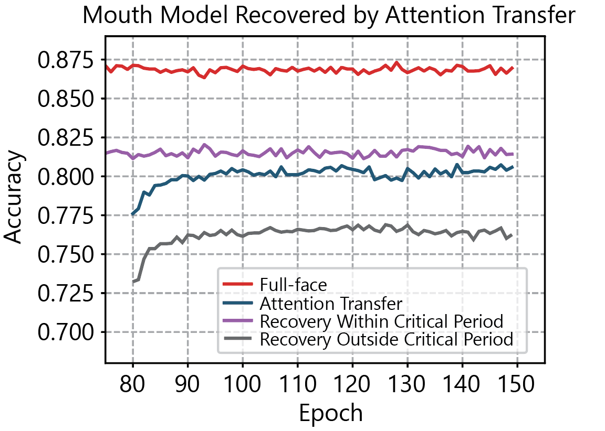
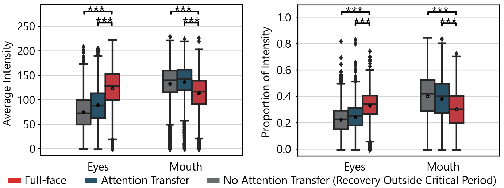

# Critical Period Analysis on Face Recognition
This is the code repository for the [paper](https://www.cell.com/patterns/pdf/S2666-3899(23)00297-0.pdf)

Our project analyzes how the Critical Period plays a role in the face-learning process with deep neural networks (DNNs). 
## Requirements
1. numpy
2. pandas
3. scipy
4. pickle
5. matplotlib
6. sklearn
7. torchvision
## Data
You can download all the data used in this project with the [link](https://drive.google.com/file/d/1mYLO-ZxjkAV4EAXfbeYySsnk2KcHr4Y-/view?usp=sharing).
Here are some examples of the data:

## Data Preprocessing
We applied foveate blurring to generate the data using different eye fixations.

## Observations
We found the critical period played an important role in the learning phase of face recognition.

## Recovery
We also proposed a method to recover the impairments caused during the Critical Period with an extremely low learning rate.

With Knowledge Distillation and Attention Transfer, we recovered the accuracy of the impaired model.

 

The recovery is also confirmed by statistical metrics

## Citation

@article{wang2024critical,
  title={A critical period for developing face recognition},
  author={Wang, Jinge and Cao, Runnan and Chakravarthula, Puneeth N and Li, Xin and Wang, Shuo},
  journal={Patterns},
  volume={5},
  number={2},
  year={2024},
  publisher={Elsevier}
}

