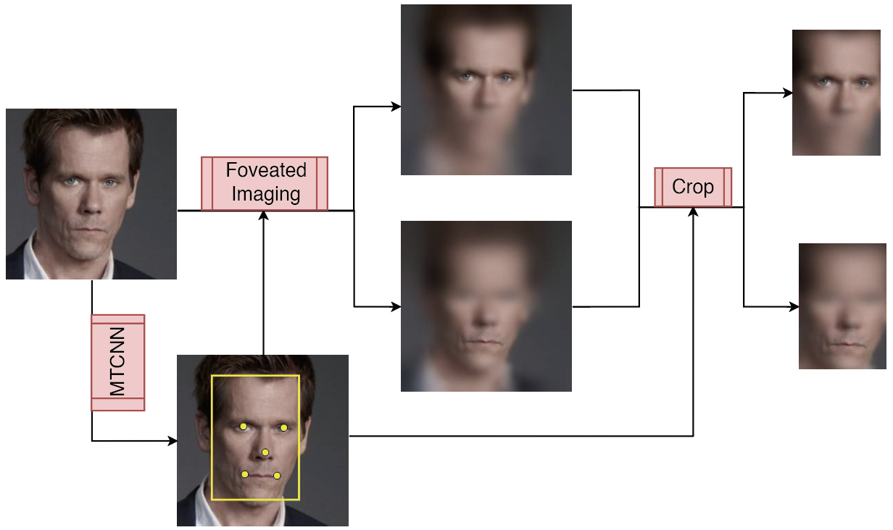
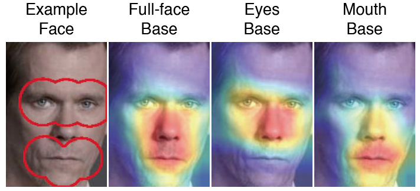
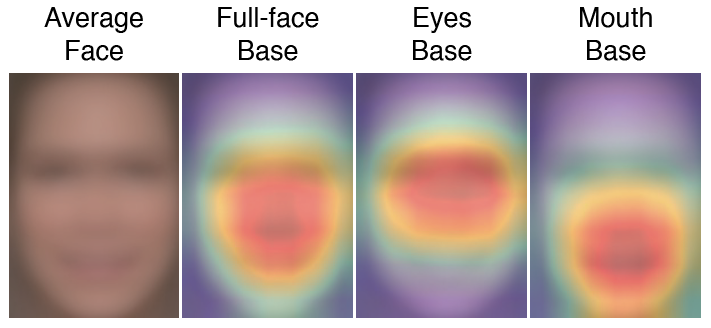
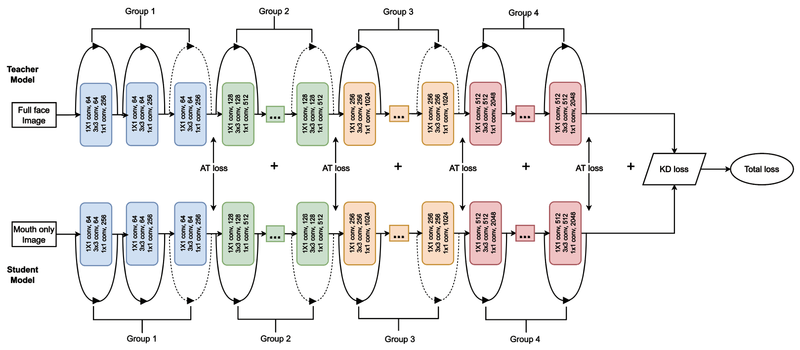
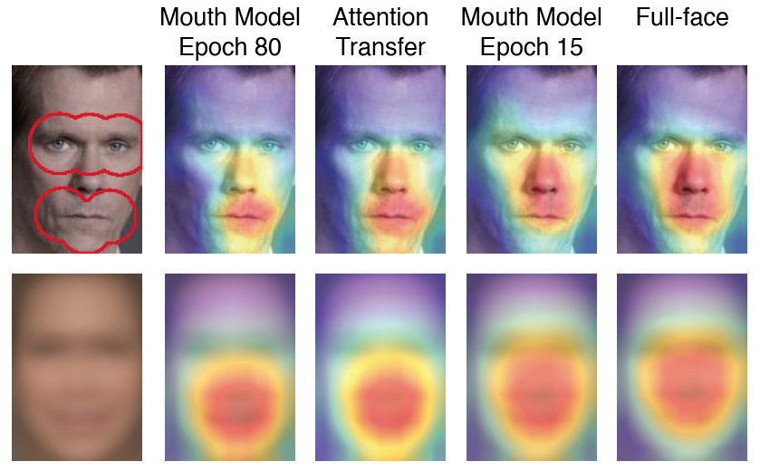

# Critical Period Analysis on Face Recognition
This project is an analysis of how the Critical Period plays a role in the face-learning process with deep neural networks (DNNs). 
## Requirements
1. numpy
2. pandas
3. scipy
4. pickle
5. matplotlib
6. sklearn
7. torchvision
## Data
You can download all the data used in this project with the [link](https://drive.google.com/file/d/1mYLO-ZxjkAV4EAXfbeYySsnk2KcHr4Y-/view?usp=sharing).
Here are some examples of the data:

## Data Preprocessing
We applied the foveate blurring to generate the data with different eye fixations.

## Observations
We found the important role that the Critical Period played in the learning phase of face recognition.

## Recovery
We also proposed a method to recover the impairments caused during the Critical Period with an extremely low learning rate.

## How to cite this material
10.5281/zenodo.8240219
